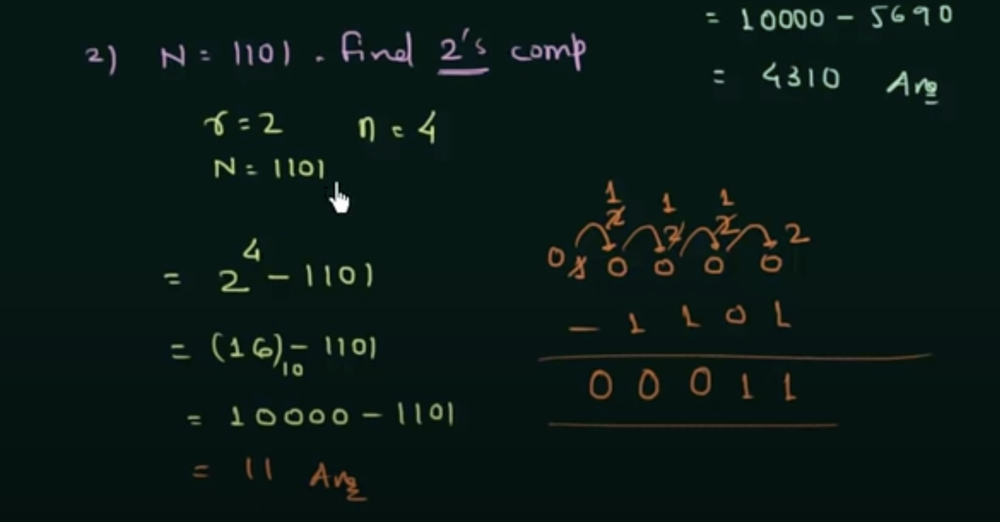

# r's Complement and r-1's Complement

Here r stands for Radix

## r's Complement

We have N  , n and r

To find complement of:

(A) (7)_10
Ans = 10 - 7 = 3

(B) (9)_10
Ans = 10 - 9 = 1

General Formula -> ```r^n - N```

r = Base
n = Number of digits
N = Number

eg ) N = (5970)_10

N = 5970
r = 10
n = 4

Ans: 10^4 - 5970 = 4310

eg ) N = (1101)_2

* 2's Compleemnt

N = 1101
r = 2
n = 4

Ans: 2^4 - 1101 = 16 - 1101 => 10000{16} - 1101 ===> 11

Here we will do Binary Subraction




## r-1's complement

if r = 10  , r-1 => 9's comp
   r = 2   ,  r-1 => 1's comp
   r = 8   ,  r-1 => 7's comp
   r = 16  ,  r-1 => 15's comp

* r's comp -> ``r^n - N`` 
* r-1's comp -> ``r^n - N - 1``
* Or r-1's comp + 1 -> r's comp

* Note: In R-1's complement no borrow operation is involved

Eg ) (5674)_7

=> r = 8
    n = 4
    N = 5674
    r^n - N
    (4096)_10 - 5674 - 1
    => 10000 - 5674  - 1 => {1000 - 1} - 5674 =>

    * No Borrow Here first calculate R-1 to get bigger number so that no borrow is involved

    7777 - 5674 => 2103 