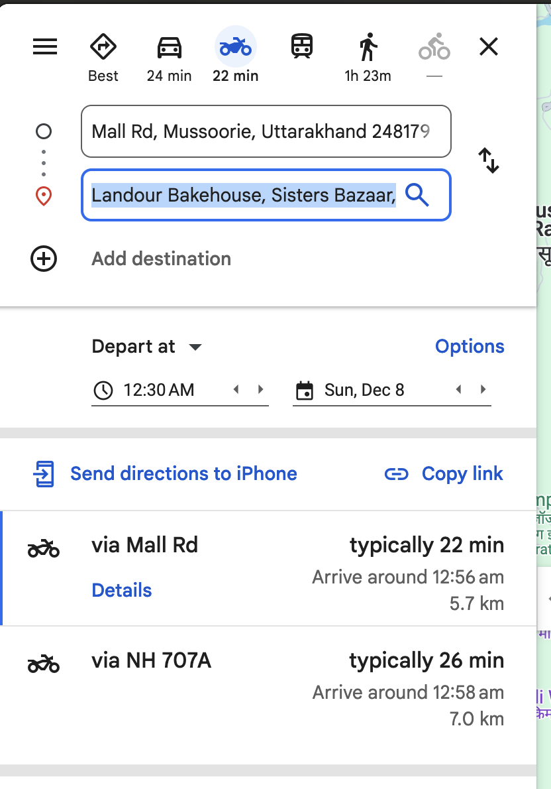
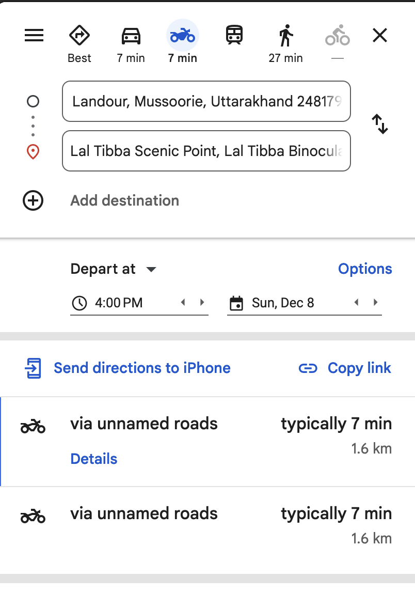
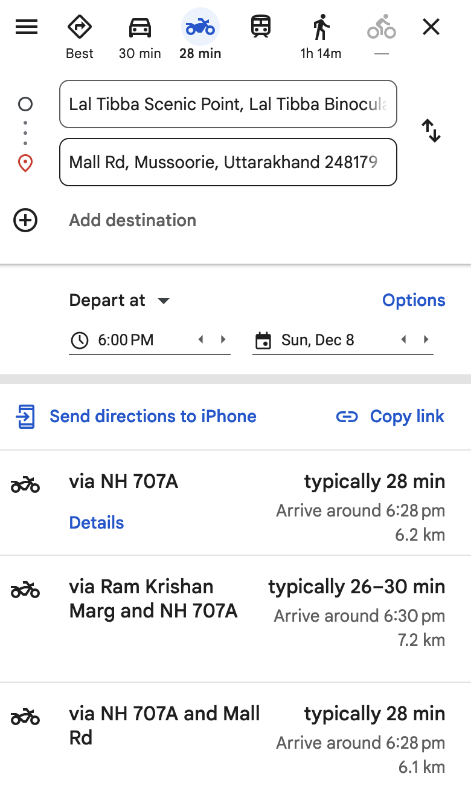
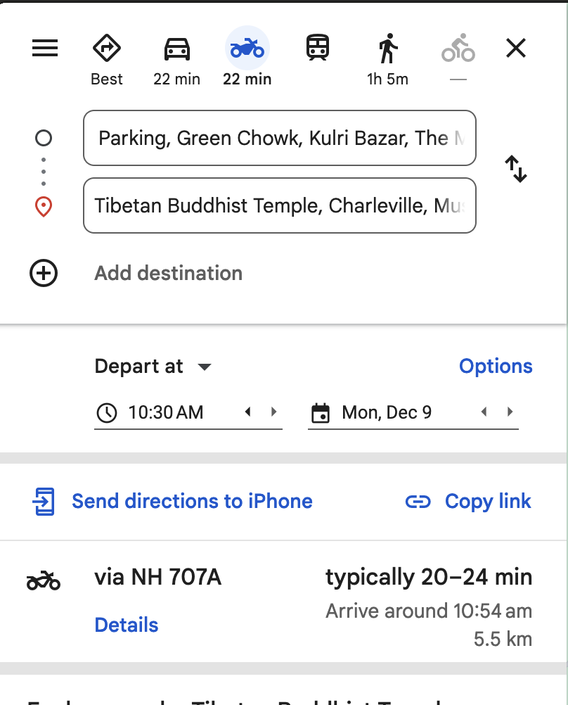

# Day 1 Sunday 
## 1st thing -> Landour (12:30pm ~ 1:30 pm - 4pm ~ 5pm )

### Things to do
* Some church thingy (St paul)
* Landour Bakehouse
* Chaar dukan for chai thingy
* Koi memorial thingy
* Landour Clock tower

## 2nd thing Landour -> Lal Tibba Scenic Point  (Try to be at sunset)

### Things to do
* Scene enjoy karo aur kya

### 3rd thing -> Enjoy Mall Road and Dinner
### Things to do
Ghumo bhai ghumo
* Cafe de Tavern (Italine restraunt )
* Kalsang  Momo
* Laphing
* Little Lama 
* Cafe BTW
* Chick Chocolate

# Day 2 Monday
## 1st thing -> Breakfast (8am - 10 am)
## 2nd thing -> Tibettian Temple 
### Things to do 
* Ghumo view enjoy karo

## 3rd thing Lunch in good place

## 4 thing Gun Hill 
### Things to do 
* Cable cart
* Telescope Point
* 2nd highest peak

## 5 thing Mall road ghumo aur khao

### Thigns to do 
* Shopping 

#
#
# Temp

* Mall Road 
    - Dope Cafe (Entry of Mall Road)
    - 
    - 
    - 
    - Cafe Hoping

* Gun Hill (2nd Highest Peak) ^_^
    - Two ways to go either ropeway (180 per person ) or trek 
    - Telescope Point
* Company Garden 25 per person

* Kempty falls

*
    - * Kimty Fall (250 inr or 250 steps sheesh)
    - * Kamta devi temple in road to kimty fall  ~~~

* Tibetetinan buddhist temple Happy Vally ^_^ 

* Cloud End

