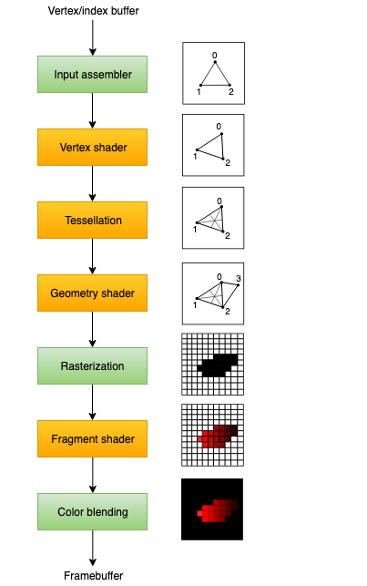
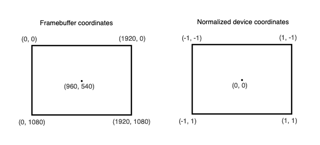

# Vulkan

A Vulkan application starts by setting up the Vulkan API through a VkInstance. An instance is created by describing your application and any API extensions you will be using. After creating the instance, you can query for Vulkan-supported hardware and select one or more VkPhysicalDevices to use for operations. You can query for properties like VRAM size and device capabilities to select desired devices, for example, to prefer using dedicated graphics cards.

After selecting the right hardware device to use, you need to create a VkDevice (logical device), where you describe more specifically which VkPhysicalDeviceFeatures you will be using, like multi-viewport rendering and 64-bit floats. You also need to specify which queue families you would like to use. Most operations performed with Vulkan, like draw commands and memory operations, are asynchronously executed by submitting them to a VkQueue. Queues are allocated from queue families, where each queue family supports a specific set of operations in its queues.

We need two more components to actually render to a window: a window surface (VkSurfaceKHR) and a swap chain (VkSwapchainKHR). Note the KHR postfix, which means that these objects are part of a Vulkan extension. The Vulkan API itself is completely platform agnostic, which is why we need to use the standardized WSI (Window System Interface) extension to interact with the window manager. The surface is a cross-platform abstraction over windows to render to and is generally instantiated by providing a reference to the native window handle, for example, HWND on Windows. Luckily, the GLFW library has a built-in function to deal with the platform-specific details of this.

The swap chain is a collection of render targets. Its basic purpose is to ensure that the image that we’re currently rendering to is different from the one that is currently on the screen. This is important to make sure that only complete images are shown. Every time we want to draw a frame we have to ask the swap chain to provide us with an image to render to. When we’ve finished drawing a frame, the image is returned to the swap chain for it to be presented to the screen at some point. The number of render targets and conditions for presenting finished images to the screen depends on the present mode. Common present modes are double buffering (vsync) and triple buffering.

Some platforms allow you to render directly to a display without interacting with any window manager through the VK_KHR_display and VK_KHR_display_swapchain extensions.

To draw to an image acquired from the swap chain, we have to wrap it into a VkImageView and VkFramebuffer. An image view references a specific part of an image to be used, and a framebuffer references image views that are to be used for color, depth, and stencil targets. Because there could be many different images in the swap chain, we’ll preemptively create an image view and framebuffer for each of them and select the right one at draw time.

Render passes in Vulkan describe the type of images that are used during rendering operations, how they will be used, and how their contents should be treated. Whereas a render pass only describes the type of images, a VkFramebuffer actually binds specific images to these slots. The graphics pipeline in Vulkan is set up by creating a VkPipeline object. It describes the configurable state of the graphics card, like the viewport size and depth buffer operation, and the programmable state using VkShaderModule objects. The VkShaderModule objects are created from shader byte code. The driver also needs to know which render targets will be used in the pipeline, which we specify by referencing the render pass.

One of the most distinctive features of Vulkan compared to existing APIs is that almost all configuration of the graphics pipeline needs to be set in advance. That means that if you want to switch to a different shader or slightly change your vertex layout, then you need to entirely recreate the graphics pipeline. That means that you will have to create many VkPipeline objects in advance for all the different combinations you need for your rendering operations. Only some basic configuration, like viewport size and clear color, can be changed dynamically. All of the state also needs to be described explicitly; there is no default color blend state.

As mentioned earlier, many of the operations in Vulkan that we want to execute, like drawing operations, need to be submitted to a queue. These operations first need to be recorded into a VkCommandBuffer before they can be submitted. These command buffers are allocated from a VkCommandPool that is associated with a specific queue family. To draw a simple triangle, we need to record a command buffer with the following operations:

    Begin the render pass
    Bind the graphics pipeline
    Draw 3 vertices
    End the render pass

Because the image in the framebuffer depends on which specific image the swap chain will give us, we need to record a command buffer for each possible image and select the right one at draw time. The alternative would be to record the command buffer again every frame, which is not as efficient.

Now that the drawing commands have been wrapped into a command buffer, the main loop is quite straightforward. We first acquire an image from the swap chain with vkAcquireNextImageKHR. We can then select the appropriate command buffer for that image and execute it with vkQueueSubmit. Finally, we return the image to the swap chain for presentation to the screen with vkQueuePresentKHR.

Operations that are submitted to queues are executed asynchronously. Therefore, we have to use synchronization objects like semaphores to ensure a correct order of execution. Execution of the draw command buffer must be set up to wait on image acquisition to finish, otherwise it may occur that we start rendering to an image that is still being read for presentation on the screen. The vkQueuePresentKHR call in turn needs to wait for rendering to be finished, for which we’ll use a second semaphore that is signaled after rendering completes.

A real-world program contains more steps, like allocating vertex buffers, creating uniform buffers, and uploading texture images.

So in short, to draw the first triangle we need to:

    Create a VkInstance
    Select a supported graphics card (VkPhysicalDevice)
    Create a VkDevice and VkQueue for drawing and presentation
    Create a window, window surface, and swap chain
    Wrap the swap chain images into VkImageView
    Create a render pass that specifies the render targets and usage
    Create framebuffers for the render pass
    Set up the graphics pipeline
    Allocate and record a command buffer with the draw commands for every possible swap chain image
    Draw frames by acquiring images, submitting the right draw command buffer, and returning the images back to the swap chain

All of the Vulkan functions, enumerations, and structs are defined in the vulkan.h header, which is included in the Vulkan SDK developed by LunarG.

Almost all functions return a VkResult that is either VK_SUCCESS or an error code. The specification describes which error codes each function can return and what they mean.

As mentioned earlier, Vulkan is designed for high performance and low driver overhead. Therefore, it will include very limited error checking and debugging capabilities by default. The driver will often crash instead of returning an error code if you do something wrong, or worse, it will appear to work on your graphics card and completely fail on others.

Vulkan allows you to enable extensive checks through a feature known as validation layers. Validation layers are pieces of code that can be inserted between the API and the graphics driver to do things like running extra checks on function parameters and tracking memory management problems. The nice thing is that you can enable them during development and then completely disable them when releasing your application for zero overhead. Anyone can write their own validation layers, but the Vulkan SDK by LunarG provides a standard set of validation layers that we’ll be using in this tutorial. You also need to register a callback function to receive debug messages from the layers.

Because Vulkan is so explicit about every operation and the validation layers are so extensive, it can actually be a lot easier to find out why your screen is black compared to OpenGL and Direct3D!

The cstdlib header provides the EXIT_SUCCESS and EXIT_FAILURE macros.

The Vulkan API is designed around the idea of minimal driver overhead and one of the manifestations of that goal is that there is very limited error checking in the API by default. Even mistakes as simple as setting enumerations to incorrect values or passing null pointers to required parameters are generally not explicitly handled and will simply result in crashes or undefined behavior. Because Vulkan requires you to be very explicit about everything you’re doing, it’s easy to make many small mistakes like using a new GPU feature and forgetting to request it at logical device creation time.

However, that doesn’t mean that these checks can’t be added to the API. Vulkan introduces an elegant system for this known as validation layers. Validation layers are optional components that hook into Vulkan function calls to apply additional operations. Common operations in validation layers are:

    Checking the values of parameters against the specification to detect misuse

    Tracking creation and destruction of objects to find resource leaks

    Checking thread safety by tracking the threads that calls originate from

    Logging every call and its parameters to the standard output

    Tracing Vulkan calls for profiling and replaying

Vulkan does not come with any validation layers built-in, but the LunarG Vulkan SDK provides a nice set of layers that check for common errors. They’re also completely open source, so you can check which kind of mistakes they check for and contribute. Using the validation layers is the best way to avoid your application breaking on different drivers by accidentally relying on undefined behavior.

There were formerly two different types of validation layers in Vulkan: instance and device specific. The idea was that instance layers would only check calls related to global Vulkan objects like instances, and device specific layers would only check calls related to a specific GPU. Device specific layers have now been deprecated, which means that instance validation layers apply to all Vulkan calls. The specification document still recommends that you enable validation layers at device level as well for compatibility, which is required by some implementations. We’ll simply specify the same layers as the instance at logical device level, which we’ll see later on.

After initializing the Vulkan library through a VkInstance we need to look for and select a graphics card in the system that supports the features we need. In fact we can select any number of graphics cards and use them simultaneously, but in this tutorial we’ll stick to the first graphics card that suits our needs.

We’ll add a function pickPhysicalDevice and add a call to it in the initVulkan function.

void initVulkan() {
    createInstance();
    setupDebugMessenger();
    pickPhysicalDevice();
}

void pickPhysicalDevice() {

}

The graphics card that we’ll end up selecting will be stored in a VkPhysicalDevice handle that is added as a new class member. This object will be implicitly destroyed when the VkInstance is destroyed, so we won’t need to do anything new in the cleanup function.

VkPhysicalDevice physicalDevice = VK_NULL_HANDLE;

Listing the graphics cards is very similar to listing extensions and starts with querying just the number.

uint32_t deviceCount = 0;
vkEnumeratePhysicalDevices(instance, &deviceCount, nullptr);

If there are 0 devices with Vulkan support then there is no point going further.

if (deviceCount == 0) {
    throw std::runtime_error("failed to find GPUs with Vulkan support!");
}

Otherwise we can now allocate an array to hold all of the VkPhysicalDevice handles.

std::vector<VkPhysicalDevice> devices(deviceCount);
vkEnumeratePhysicalDevices(instance, &deviceCount, devices.data());

Now we need to evaluate each of them and check if they are suitable for the operations we want to perform, because not all graphics cards are created equal. For that we’ll introduce a new function:

bool isDeviceSuitable(VkPhysicalDevice device) {
    return true;
}

And we’ll check if any of the physical devices meet the requirements that we’ll add to that function.

for (const auto& device : devices) {
    if (isDeviceSuitable(device)) {
        physicalDevice = device;
        break;
    }
}

if (physicalDevice == VK_NULL_HANDLE) {
    throw std::runtime_error("failed to find a suitable GPU!");
}

The next section will introduce the first requirements that we’ll check for in the isDeviceSuitable function. As we’ll start using more Vulkan features in the later chapters we will also extend this function to include more checks.

After selecting a physical device to use we need to set up a logical device to interface with it. The logical device creation process is similar to the instance creation process and describes the features we want to use. We also need to specify which queues to create now that we’ve queried which queue families are available. You can even create multiple logical devices from the same physical device if you have varying requirements.

Start by adding a new class member to store the logical device handle in.

VkDevice device;

Next, add a createLogicalDevice function that is called from initVulkan.

The creation of a logical device involves specifying a bunch of details in structs again, of which the first one will be VkDeviceQueueCreateInfo

The currently available drivers will only allow you to create a small number of queues for each queue family and you don’t really need more than one. That’s because you can create all of the command buffers on multiple threads and then submit them all at once on the main thread with a single low-overhead call.

Vulkan lets you assign priorities to queues to influence the scheduling of command buffer execution using floating point numbers between 0.0 and 1.0. This is required even if there is only a single queue:

The next information to specify is the set of device features that we’ll be using. These are the features that we queried support for with vkGetPhysicalDeviceFeatures

The queues are automatically created along with the logical device, but we don’t have a handle to interface with them yet. First add a class member to store a handle to the graphics queue:

Device queues are implicitly cleaned up when the device is destroyed, so we don’t need to do anything in cleanup.

We can use the vkGetDeviceQueue function to retrieve queue handles for each queue family. The parameters are the logical device, queue family, queue index and a pointer to the variable to store the queue handle in. Because we’re only creating a single queue from this family, we’ll simply use index 0

Since Vulkan is a platform agnostic API, it can not interface directly with the window system on its own. To establish the connection between Vulkan and the window system to present results to the screen, we need to use the WSI (Window System Integration) extensions. In this chapter we’ll discuss the first one, which is VK_KHR_surface. It exposes a VkSurfaceKHR object that represents an abstract type of surface to present rendered images to. The surface in our program will be backed by the window that we’ve already opened with GLFW.

The VK_KHR_surface extension is an instance level extension and we’ve actually already enabled it, because it’s included in the list returned by glfwGetRequiredInstanceExtensions. The list also includes some other WSI extensions that we’ll use in the next couple of chapters.

The window surface needs to be created right after the instance creation, because it can actually influence the physical device selection. The reason we postponed this is because window surfaces are part of the larger topic of render targets and presentation for which the explanation would have cluttered the basic setup. It should also be noted that window surfaces are an entirely optional component in Vulkan, if you just need off-screen rendering. Vulkan allows you to do that without hacks like creating an invisible window (necessary for OpenGL).

Window surface creation

Start by adding a surface class member right below the debug callback.

VkSurfaceKHR surface;

Because a window surface is a Vulkan object, it comes with a VkWin32SurfaceCreateInfoKHR struct that needs to be filled in. It has two important parameters: hwnd and hinstance. These are the handles to the window and the process.

The glfwGetWin32Window function is used to get the raw HWND from the GLFW window object. The GetModuleHandle call returns the HINSTANCE handle of the current process.

After that the surface can be created with vkCreateWin32SurfaceKHR, which includes a parameter for the instance, surface creation details, custom allocators and the variable for the surface handle to be stored in. Technically this is a WSI extension function, but it is so commonly used that the standard Vulkan loader includes it, so unlike other extensions you don’t need to explicitly load it.

The process is similar for other platforms like Linux, where vkCreateXcbSurfaceKHR takes an XCB connection and window as creation details with X11.
The glfwCreateWindowSurface function performs exactly this operation with a different implementation for each platform. We’ll now integrate it into our program. Add a function createSurface to be called from initVulkan right after instance creation and setupDebugMessenger

Although the Vulkan implementation may support window system integration, that does not mean that every device in the system supports it. Therefore we need to extend isDeviceSuitable to ensure that a device can present images to the surface we created. Since the presentation is a queue-specific feature, the problem is actually about finding a queue family that supports presenting to the surface we created.

The one thing that remains is modifying the logical device creation procedure to create the presentation queue and retrieve the VkQueue handle. Add a member variable for the handle

Next, we need to have multiple VkDeviceQueueCreateInfo structs to create a queue from both families. An elegant way to do that is to create a set of all unique queue families that are necessary for the required queues:

And modify VkDeviceCreateInfo to point to the vector:

If the queue families are the same, then we only need to pass its index once. Finally, add a call to retrieve the queue handle:

In case the queue families are the same, the two handles will most likely have the same value now

Swap chain

Vulkan does not have the concept of a "default framebuffer", hence it requires an infrastructure that will own the buffers we will render to before we visualize them on the screen. This infrastructure is known as the swap chain and must be created explicitly in Vulkan. The swap chain is essentially a queue of images that are waiting to be presented to the screen. Our application will acquire such an image to draw to it, and then return it to the queue. How exactly the queue works and the conditions for presenting an image from the queue depend on how the swap chain is set up, but the general purpose of the swap chain is to synchronize the presentation of images with the refresh rate of the screen.

Checking for swap chain support

Not all graphics cards are capable of presenting images directly to a screen for various reasons, for example because they are designed for servers and don’t have any display outputs. Secondly, since image presentation is heavily tied into the window system and the surfaces associated with windows, it is not actually part of the Vulkan core. You have to enable the VK_KHR_swapchain device extension after querying for its support.

We’ll now write a couple of functions to find the right settings for the best possible swap chain. There are three types of settings to determine:

    Surface format (color depth)

    Presentation mode (conditions for "swapping" images to the screen)

    Swap extent (resolution of images in swap chain)

Presentation mode

The presentation mode is arguably the most important setting for the swap chain, because it represents the actual conditions for showing images to the screen. There are four possible modes available in Vulkan:

    VK_PRESENT_MODE_IMMEDIATE_KHR: Images submitted by your application are transferred to the screen right away, which may result in tearing.

    VK_PRESENT_MODE_FIFO_KHR: The swap chain is a queue where the display takes an image from the front of the queue when the display is refreshed and the program inserts rendered images at the back of the queue. If the queue is full then the program has to wait. This is most similar to vertical sync as found in modern games. The moment that the display is refreshed is known as "vertical blank".

    VK_PRESENT_MODE_FIFO_RELAXED_KHR: This mode only differs from the previous one if the application is late and the queue was empty at the last vertical blank. Instead of waiting for the next vertical blank, the image is transferred right away when it finally arrives. This may result in visible tearing.

    VK_PRESENT_MODE_MAILBOX_KHR: This is another variation of the second mode. Instead of blocking the application when the queue is full, the images that are already queued are simply replaced with the newer ones. This mode can be used to render frames as fast as possible while still avoiding tearing, resulting in fewer latency issues than standard vertical sync. This is commonly known as "triple buffering", although the existence of three buffers alone does not necessarily mean that the framerate is unlocked.

The swap extent is the resolution of the swap chain images and it’s almost always exactly equal to the resolution of the window that we’re drawing to in pixels (more on that in a moment). The range of the possible resolutions is defined in the VkSurfaceCapabilitiesKHR structure. 

Now that we have all of these helper functions assisting us with the choices we have to make at runtime, we finally have all the information that is needed to create a working swap chain.

Create a createSwapChain function that starts out with the results of these calls and make sure to call it from initVulkan after logical device creation.

Image views

To use any VkImage, including those in the swap chain, in the render pipeline we have to create a VkImageView object. An image view is quite literally a view into an image. It describes how to access the image and which part of the image to access, for example if it should be treated as a 2D texture depth texture without any mipmapping levels.

Creating the image view is now a matter of calling vkCreateImageView:

Unlike images, the image views were explicitly created by us, so we need to add a similar loop to destroy them again at the end of the program:

void cleanup() {
    for (auto imageView : swapChainImageViews) {
        vkDestroyImageView(device, imageView, nullptr);
    }

    ...
}

The graphics pipeline is the sequence of operations that take the vertices and textures of your meshes all the way to the pixels in the render targets. A simplified overview is displayed below:

The input assembler collects the raw vertex data from the buffers you specify and may also use an index buffer to repeat certain elements without having to duplicate the vertex data itself.

The vertex shader is run for every vertex and generally applies transformations to turn vertex positions from model space to screen space. It also passes per-vertex data down the pipeline.

The tessellation shaders allow you to subdivide geometry based on certain rules to increase the mesh quality. This is often used to make surfaces like brick walls and staircases look less flat when they are nearby.

The geometry shader is run on every primitive (triangle, line, point) and can discard it or output more primitives than came in. This is similar to the tessellation shader, but much more flexible. However, it is not used much in today’s applications because the performance is not that good on most graphics cards except for Intel’s integrated GPUs.

The rasterization stage discretizes the primitives into fragments. These are the pixel elements that they fill on the framebuffer. Any fragments that fall outside the screen are discarded and the attributes outputted by the vertex shader are interpolated across the fragments, as shown in the figure. Usually the fragments that are behind other primitive fragments are also discarded here because of depth testing.

The fragment shader is invoked for every fragment that survives and determines which framebuffer(s) the fragments are written to and with which color and depth values. It can do this using the interpolated data from the vertex shader, which can include things like texture coordinates and normals for lighting.

The color blending stage applies operations to mix different fragments that map to the same pixel in the framebuffer. Fragments can simply overwrite each other, add up or be mixed based upon transparency.

Stages with a green color are known as fixed-function stages. These stages allow you to tweak their operations using parameters, but the way they work is predefined.

Stages with an orange color on the other hand are programmable, which means that you can upload your own code to the graphics card to apply exactly the operations you want. This allows you to use fragment shaders, for example, to implement anything from texturing and lighting to ray tracers. These programs run on many GPU cores simultaneously to process many objects, like vertices and fragments in parallel.

If you’ve used older APIs like OpenGL and Direct3D before, then you’ll be used to being able to change any pipeline settings at will with calls like glBlendFunc and OMSetBlendState. The graphics pipeline in Vulkan is almost completely immutable, so you must recreate the pipeline from scratch if you want to change shaders, bind different framebuffers or change the blend function. The disadvantage is that you’ll have to create a number of pipelines that represent all of the different combinations of states you want to use in your rendering operations. However, because all of the operations you’ll be doing in the pipeline are known in advance, the driver can optimize for it much better.

Some of the programmable stages are optional based on what you intend to do. For example, the tessellation and geometry stages can be disabled if you are just drawing simple geometry. If you are only interested in depth values then you can disable the fragment shader stage, which is useful for shadow map generation.

Create a createGraphicsPipeline function that is called right after createImageViews in initVulkan. We’ll work on this function throughout the following chapters.

Shader modules

Unlike earlier APIs, shader code in Vulkan has to be specified in a bytecode format as opposed to human-readable syntax like GLSL and HLSL. This bytecode format is called SPIR-V and is designed to be used with both Vulkan and OpenCL (both Khronos APIs). It is a format that can be used to write graphics and compute shaders, but we will focus on shaders used in Vulkan’s graphics pipelines in this tutorial.

The advantage of using a bytecode format is that the compilers written by GPU vendors to turn shader code into native code are significantly less complex. The past has shown that with human-readable syntax like GLSL, some GPU vendors were rather flexible with their interpretation of the standard. If you happen to write non-trivial shaders with a GPU from one of these vendors, then you’d risk other vendor’s drivers rejecting your code due to syntax errors, or worse, your shader running differently because of compiler bugs. With a straightforward bytecode format like SPIR-V that will hopefully be avoided.

However, that does not mean that we need to write this bytecode by hand. Khronos has released their own vendor-independent compiler that compiles GLSL to SPIR-V. This compiler is designed to verify that your shader code is fully standards compliant and produces one SPIR-V binary that you can ship with your program. You can also include this compiler as a library to produce SPIR-V at runtime, but we won’t be doing that in this tutorial. Although we can use this compiler directly via glslangValidator.exe, we will be using glslc.exe by Google instead. The advantage of glslc is that it uses the same parameter format as well-known compilers like GCC and Clang and includes some extra functionality like includes. Both of them are already included in the Vulkan SDK, so you don’t need to download anything extra.

GLSL is a shading language with a C-style syntax. Programs written in it have a main function that is invoked for every object. Instead of using parameters for input and a return value as output, GLSL uses global variables to handle input and output. The language includes many features to aid in graphics programming, like built-in vector and matrix primitives. Functions for operations like cross products, matrix-vector products and reflections around a vector are included. The vector type is called vec with a number indicating the amount of elements. For example, a 3D position would be stored in a vec3. It is possible to access single components through members like .x, but it’s also possible to create a new vector from multiple components at the same time. For example, the expression vec3(1.0, 2.0, 3.0).xy would result in vec2. The constructors of vectors can also take combinations of vector objects and scalar values. For example, a vec3 can be constructed with vec3(vec2(1.0, 2.0), 3.0).

Vertex shader

The vertex shader processes each incoming vertex. It takes its attributes, like model space position, color, normal and texture coordinates as input. The output is the final position in clip coordinates and the attributes that need to be passed on to the fragment shader, like color and texture coordinates. These values will then be interpolated over the fragments by the rasterizer to produce a smooth gradient.

A clip coordinate is a four dimensional vector from the vertex shader that is subsequently turned into a normalized device coordinate by dividing the whole vector by its last component. These normalized device coordinates are homogeneous coordinates that map the framebuffer to a [-1, 1] by [-1, 1] coordinate system that looks like the following:

Fragment shader

The triangle that is formed by the positions from the vertex shader fills an area on the screen with fragments. The fragment shader is invoked on these fragments to produce a color and depth for the framebuffer (or framebuffers). A simple fragment shader that outputs the color red for the entire triangle looks like this:

The main function is called for every fragment just like the vertex shader main function is called for every vertex. Colors in GLSL are 4-component vectors with the R, G, B and alpha channels within the [0, 1] range. Unlike gl_Position in the vertex shader, there is no built-in variable to output a color for the current fragment. You have to specify your own output variable for each framebuffer where the layout(location = 0) modifier specifies the index of the framebuffer. The color red is written to this outColor variable that is linked to the first (and only) framebuffer at index 0.

Per-vertex colors

Making the entire triangle red is not very interesting, wouldn’t something like the following look a lot nicer?

We have to make a couple of changes to both shaders to accomplish this. First off, we need to specify a distinct color for each of the three vertices. The vertex shader should now include an array with colors just like it does for positions:

Now we just need to pass these per-vertex colors to the fragment shader so it can output their interpolated values to the framebuffer. Add an output for color to the vertex shader and write to it in the main function:

Next, we need to add a matching input in the fragment shader:

The input variable does not necessarily have to use the same name, they will be linked together using the indexes specified by the location directives. The main function has been modified to output the color along with an alpha value. As shown in the image above, the values for fragColor will be automatically interpolated for the fragments between the three vertices, resulting in a smooth gradient.

Compiling the shaders

Create a directory called shaders in the root directory of your project and store the vertex shader in a file called shader.vert and the fragment shader in a file called shader.frag in that directory. GLSL shaders don’t have an official extension, but these two are commonly used to distinguish them.

The contents of shader.vert should be:

We’re now going to compile these into SPIR-V bytecode using the glslc program.

Loading a shader

Now that we have a way of producing SPIR-V shaders, it’s time to load them into our program to plug them into the graphics pipeline at some point. We’ll first write a simple helper function to load the binary data from the files.

#include <fstream>

...

static std::vector<char> readFile(const std::string& filename) {
    std::ifstream file(filename, std::ios::ate | std::ios::binary);

    if (!file.is_open()) {
        throw std::runtime_error("failed to open file!");
    }
}

The readFile function will read all of the bytes from the specified file and return them in a byte array managed by std::vector. We start by opening the file with two flags:

    ate: Start reading at the end of the file

    binary: Read the file as binary file (avoid text transformations)

The advantage of starting to read at the end of the file is that we can use the read position to determine the size of the file and allocate a buffer:

Creating shader modules

Before we can pass the code to the pipeline, we have to wrap it in a VkShaderModule object. Let’s create a helper function createShaderModule to do that.

The function will take a buffer with the bytecode as parameter and create a VkShaderModule from it.

Creating a shader module is simple, we only need to specify a pointer to the buffer with the bytecode and the length of it. This information is specified in a VkShaderModuleCreateInfo structure. The one catch is that the size of the bytecode is specified in bytes, but the bytecode pointer is a uint32_t pointer rather than a char pointer. Therefore we will need to cast the pointer with reinterpret_cast as shown below. When you perform a cast like this, you also need to ensure that the data satisfies the alignment requirements of uint32_t. Lucky for us, the data is stored in an std::vector where the default allocator already ensures that the data satisfies the worst case alignment requirements.

Shader modules are just a thin wrapper around the shader bytecode that we’ve previously loaded from a file and the functions defined in it. The compilation and linking of the SPIR-V bytecode to machine code for execution by the GPU doesn’t happen until the graphics pipeline is created. That means that we’re allowed to destroy the shader modules again as soon as pipeline creation is finished, which is why we’ll make them local variables in the createGraphicsPipeline

Shader stage creation

To actually use the shaders we’ll need to assign them to a specific pipeline stage through VkPipelineShaderStageCreateInfo structures as part of the actual pipeline creation process

Fixed functions

The older graphics APIs provided default state for most of the stages of the graphics pipeline. In Vulkan you have to be explicit about most pipeline states as it’ll be baked into an immutable pipeline state object. In this chapter we’ll fill in all of the structures to configure these fixed-function operations

Dynamic state

While most of the pipeline state needs to be baked into the pipeline state, a limited amount of the state can actually be changed without recreating the pipeline at draw time. Examples are the size of the viewport, line width and blend constants. If you want to use dynamic state and keep these properties out, then you’ll have to fill in a VkPipelineDynamicStateCreateInfo structure like this:

Vertex input

The VkPipelineVertexInputStateCreateInfo structure describes the format of the vertex data that will be passed to the vertex shader. It describes this in roughly two ways:

    Bindings: spacing between data and whether the data is per-vertex or per-instance (see instancing)

    Attribute descriptions: type of the attributes passed to the vertex shader, which binding to load them from and at which offset

Input assembly

The VkPipelineInputAssemblyStateCreateInfo struct describes two things: what kind of geometry will be drawn from the vertices and if primitive restart should be enabled. The former is specified in the topology member and can have values like:

    VK_PRIMITIVE_TOPOLOGY_POINT_LIST: points from vertices

    VK_PRIMITIVE_TOPOLOGY_LINE_LIST: line from every 2 vertices without reuse

    VK_PRIMITIVE_TOPOLOGY_LINE_STRIP: the end vertex of every line is used as start vertex for the next line

    VK_PRIMITIVE_TOPOLOGY_TRIANGLE_LIST: triangle from every 3 vertices without reuse

    VK_PRIMITIVE_TOPOLOGY_TRIANGLE_STRIP: the second and third vertex of every triangle are used as first two vertices of the next triangle

Normally, the vertices are loaded from the vertex buffer by index in sequential order, but with an element buffer you can specify the indices to use yourself. This allows you to perform optimizations like reusing vertices. If you set the primitiveRestartEnable member to VK_TRUE, then it’s possible to break up lines and triangles in the _STRIP topology modes by using a special index of 0xFFFF or 0xFFFFFFFF.

Viewports and scissors

A viewport basically describes the region of the framebuffer that the output will be rendered to. This will almost always be (0, 0) to (width, height)

Remember that the size of the swap chain and its images may differ from the WIDTH and HEIGHT of the window. The swap chain images will be used as framebuffers later on, so we should stick to their size.

The minDepth and maxDepth values specify the range of depth values to use for the framebuffer. These values must be within the [0.0f, 1.0f] range, but minDepth may be higher than maxDepth. If you aren’t doing anything special, then you should stick to the standard values of 0.0f and 1.0f.

While viewports define the transformation from the image to the framebuffer, scissor rectangles define in which regions pixels will actually be stored. Any pixels outside the scissor rectangles will be discarded by the rasterizer. They function like a filter rather than a transformation. The difference is illustrated below. Note that the left scissor rectangle is just one of the many possibilities that would result in that image, as long as it’s larger than the viewport.

Viewport(s) and scissor rectangle(s) can either be specified as a static part of the pipeline or as a dynamic state set in the command buffer. While the former is more in line with the other states it’s often convenient to make viewport and scissor state dynamic as it gives you a lot more flexibility. This is very common and all implementations can handle this dynamic state without a performance penalty.

Rasterizer

The rasterizer takes the geometry that is shaped by the vertices from the vertex shader and turns it into fragments to be colored by the fragment shader. It also performs depth testing, face culling and the scissor test, and it can be configured to output fragments that fill entire polygons or just the edges (wireframe rendering). All this is configured using the VkPipelineRasterizationStateCreateInfo structure.

If depthClampEnable is set to VK_TRUE, then fragments that are beyond the near and far planes are clamped to them as opposed to discarding them. This is useful in some special cases like shadow maps. Using this requires enabling a GPU feature.

If rasterizerDiscardEnable is set to VK_TRUE, then geometry never passes through the rasterizer stage. This basically disables any output to the framebuffer.

The polygonMode determines how fragments are generated for geometry. The following modes are available:

    VK_POLYGON_MODE_FILL: fill the area of the polygon with fragments

    VK_POLYGON_MODE_LINE: polygon edges are drawn as lines

    VK_POLYGON_MODE_POINT: polygon vertices are drawn as points

Using any mode other than fill requires enabling a GPU feature.

rasterizer.lineWidth = 1.0f;

The lineWidth member is straightforward, it describes the thickness of lines in terms of number of fragments. The maximum line width that is supported depends on the hardware and any line thicker than 1.0f requires you to enable the wideLines GPU feature.

The cullMode variable determines the type of face culling to use. You can disable culling, cull the front faces, cull the back faces or both. The frontFace variable specifies the vertex order for faces to be considered front-facing and can be clockwise or counterclockwise.

The rasterizer can alter the depth values by adding a constant value or biasing them based on a fragment’s slope. This is sometimes used for shadow mapping, but we won’t be using it. Just set depthBiasEnable to VK_FALSE.

Multisampling

The VkPipelineMultisampleStateCreateInfo struct configures multisampling, which is one of the ways to perform anti-aliasing. It works by combining the fragment shader results of multiple polygons that rasterize to the same pixel. This mainly occurs along edges, which is also where the most noticeable aliasing artifacts occur. Because it doesn’t need to run the fragment shader multiple times if only one polygon maps to a pixel, it is significantly less expensive than simply rendering to a higher resolution and then downscaling. Enabling it requires enabling a GPU feature.

Depth and stencil testing

If you are using a depth and/or stencil buffer, then you also need to configure the depth and stencil tests using VkPipelineDepthStencilStateCreateInfo. We don’t have one right now, so we can simply pass a nullptr instead of a pointer to such a struct. We’ll get back to it in the depth buffering chapter.

Color blending

After a fragment shader has returned a color, it needs to be combined with the color that is already in the framebuffer. This transformation is known as color blending and there are two ways to do it:

    Mix the old and new value to produce a final color

    Combine the old and new value using a bitwise operation

There are two types of structs to configure color blending. The first struct, VkPipelineColorBlendAttachmentState contains the configuration per attached framebuffer and the second struct, VkPipelineColorBlendStateCreateInfo contains the global color blending settings. In our case we only have one framebuffer:

Pipeline layout

You can use uniform values in shaders, which are globals similar to dynamic state variables that can be changed at drawing time to alter the behavior of your shaders without having to recreate them. They are commonly used to pass the transformation matrix to the vertex shader, or to create texture samplers in the fragment shader.

Render passes
Setup

Before we can finish creating the pipeline, we need to tell Vulkan about the framebuffer attachments that will be used while rendering. We need to specify how many color and depth buffers there will be, how many samples to use for each of them and how their contents should be handled throughout the rendering operations. All of this information is wrapped in a render pass object, for which we’ll create a new createRenderPass function. Call this function from initVulkan before createGraphicsPipeline

Textures and framebuffers in Vulkan are represented by VkImage objects with a certain pixel format, however the layout of the pixels in memory can change based on what you’re trying to do with an image.

Some of the most common layouts are:

    VK_IMAGE_LAYOUT_COLOR_ATTACHMENT_OPTIMAL: Images used as color attachment

    VK_IMAGE_LAYOUT_PRESENT_SRC_KHR: Images to be presented in the swap chain

    VK_IMAGE_LAYOUT_TRANSFER_DST_OPTIMAL: Images to be used as destination for a memory copy operation

Render pass

Now that the attachment and a basic subpass referencing it have been described, we can create the render pass itself. Create a new class member variable to hold the VkRenderPass object right above the pipelineLayout variable:

The render pass object can then be created by filling in the VkRenderPassCreateInfo structure with an array of attachments and subpasses. The VkAttachmentReference objects reference attachments using the indices of this array.

Framebuffers

We’ve talked a lot about framebuffers in the past few chapters and we’ve set up the render pass to expect a single framebuffer with the same format as the swap chain images, but we haven’t actually created any yet.

The attachments specified during render pass creation are bound by wrapping them into a VkFramebuffer object. A framebuffer object references all of the VkImageView objects that represent the attachments. In our case that will be only a single one: the color attachment. However, the image that we have to use for the attachment depends on which image the swap chain returns when we retrieve one for presentation. That means that we have to create a framebuffer for all of the images in the swap chain and use the one that corresponds to the retrieved image at drawing time.

Command Buffers

Commands in Vulkan, like drawing operations and memory transfers, are not executed directly using function calls. You have to record all of the operations you want to perform in command buffer objects. The advantage of this is that when we are ready to tell the Vulkan what we want to do, all of the commands are submitted together and Vulkan can more efficiently process the commands since all of them are available together. In addition, this allows command recording to happen in multiple threads if so desired.